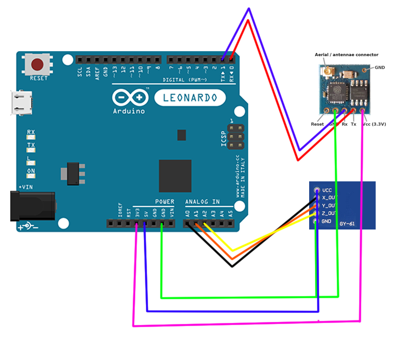
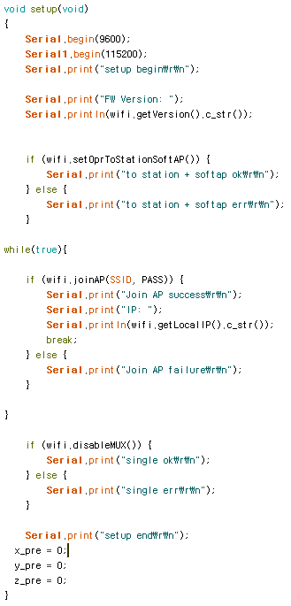
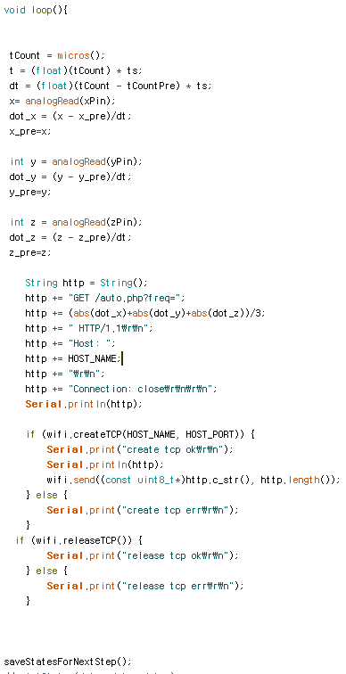
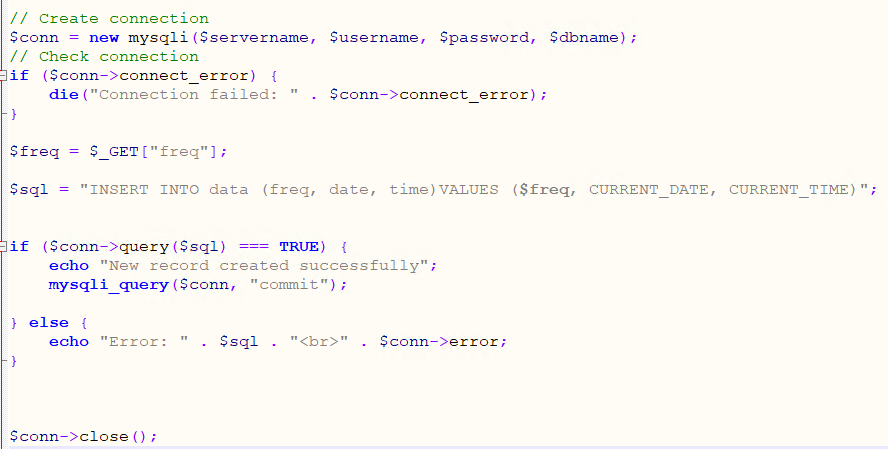
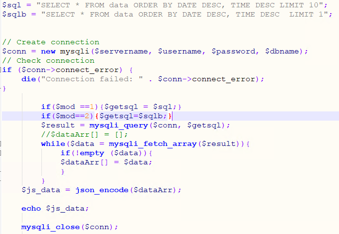
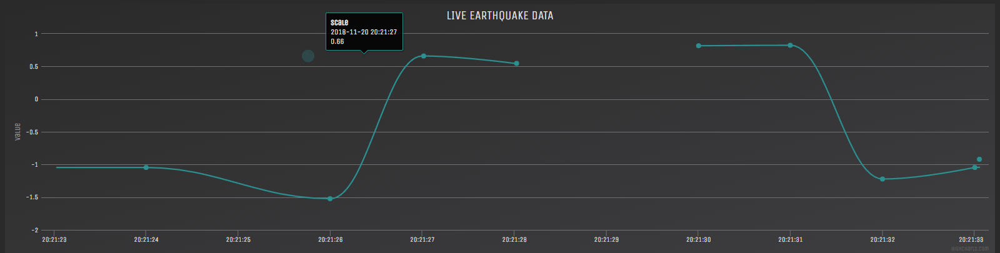

# Earthquake Finder

> 프로그램 종류 : 임베디드, 웹, 데이터베이스 
>
> 사용 언어 : Arduino C, PHP, Javascript
>
> 사용 라이브러리 : ITEADLIB_Arduino_WeeESP8266, jQuery, Highcharts
>
> 프로젝트 소스 링크 : https://github.com/murbong/earthquakeModule
>
> 웹 사이트 링크 : https://earthquake.murbong.ga
>
> 본인의 역할 : 아두이노 프로그래밍 및 서버 연결

## 설명

아두이노를 이용해 각 가속도를 구해, 서버에 데이터를 보낸다.

서버측에서는 PHP와 MYSQL을 이용해 데이터베이스에 데이터를 저장한다.

사용자가 웹 사이트로 들어간다면, JQuery로 데이터를 불러온 뒤, Highcharts로 데이터를 가시화한다.

### 아두이노 회로도

> RX와 TX를 크로스 한 이유? 송신 수신부이기 때문에 크로스 해줘야한다.

GY-61의 X, Y, Z축을 아날로그 핀 0, 1, 2에 할당했다. 또한 ESP-8266 모듈을 레오나르도 보드의 시리얼 통신 디지털 핀에 할당했다.

## 소스 코드

아두이노의 와이파이모듈은 AT Command를 사용해 보드와 통신하는데, 이를 함수로 만든 헤더 ESP8266.h를 사용했다.

컴퓨터와 통신해 디버깅을 하는 Serial, 와이파이 모듈과 통신하는 Serial1이 있다.

아두이노 setup에서는 와이파이 모듈의 기능 변경과 와이파이 탐색을 수행한다.

와이파이가 탐색될때까지 joinAP를 수행하고, 연결이 된다면 와이파이의 멀티플렉스 모드를 비활성화 한다.

루프에서는 X, Y, Z 축의 각을 아날로그로 불러온 뒤, 마이크로초 단위로 미분한다. 그러면 현재 각의 가속도가 나오게 된다.

그다음 미분한 X,Y,Z 축의 평균을 구해 TCP로 데이터를 전송한다.

데이터를 너무 많이 보내면 안되므로, 따로 delay를 1초 준다.

> delay(1000);

> 예시 : http://earthquake.murbong.ga/auto.php?freq=10

PHP를 이용한 SQL 쿼리로  MYSQL 데이터베이스에 진동수를 Insert한다. 그리고 현재 시간은 mysql에서 지원하는 CURRENT_DATE와 CURRENT_TIME을 사용했다.

date와 time으로 내림차순 정렬하여 맨 마지막으로 추가된 레코드를 불러온다. 그런 다음 javascript에서 사용할 수 있게 쿼리문을 json 형식으로 인코딩한다.

## 웹페이지 예시

> https://earthquake.murbong.ga/

